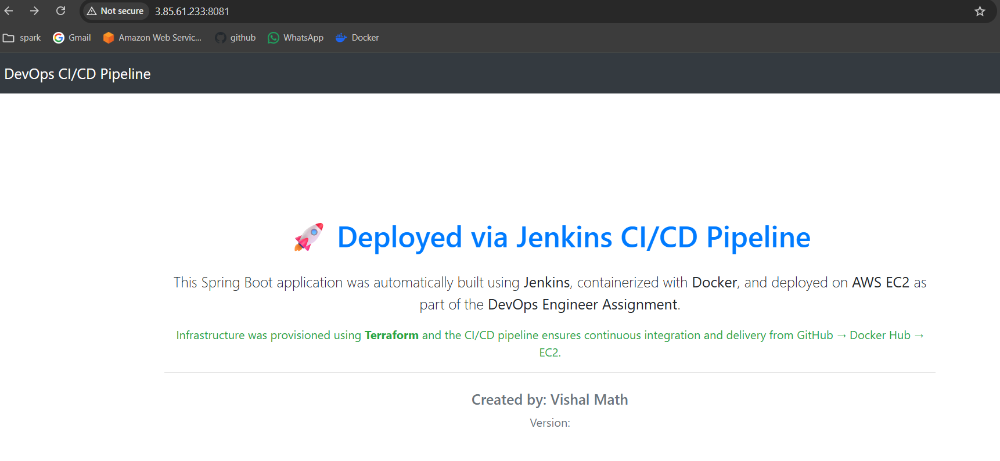
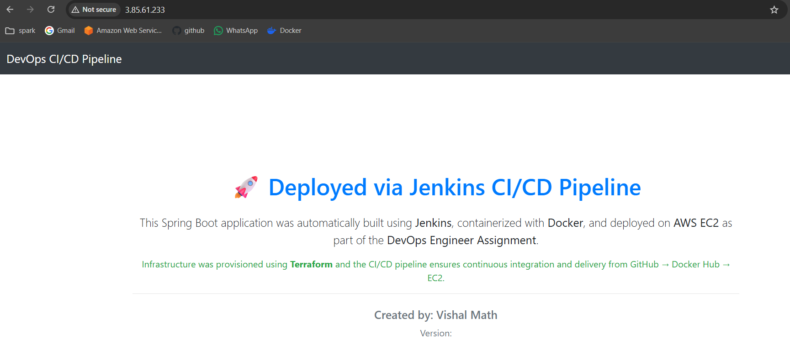

# CI/CD Pipeline for Spring Boot Application 🚀

## Overview
This project demonstrates a complete **CI/CD pipeline** for a **Spring Boot application** using **Jenkins**, **Docker**, and **AWS EC2**.

The pipeline automates:
- Build & packaging
- Docker image creation
- Image push to Docker Hub
- Vulnerability scanning using Trivy
- Deployment to staging and production environments

---

## Tech Stack

| Purpose | Tool |
|-------|------|
| CI/CD | Jenkins |
| Source Control | GitHub |
| Build Tool | Maven |
| Containerization | Docker |
| Image Registry | Docker Hub |
| Security Scan | Trivy |
| Cloud | AWS EC2 |
| Notifications | Jenkins Email Extension |

---

## CI/CD Pipeline Flow

1. Checkout source code from GitHub  
2. Build Spring Boot application using Maven  
3. Create Docker image  
4. Push image to Docker Hub  
5. Scan Docker image using Trivy  
6. Deploy application to **Staging (port 8081)**  
7. Manual approval step  
8. Deploy application to **Production**

---

## Jenkins Credentials Used

| Credential ID | Type | Purpose |
|--------------|------|--------|
| `dockerhub` | Username & Password | Docker Hub login |
| `ssh-key` | SSH Private Key | EC2 access |

---

## Project Structure

spring-boot-app/
├── Dockerfile
├── Jenkinsfile
├── pom.xml
├── src/
├── images/
│ ├── app-home.png
│ └── app-health.png
└── README.md

---

## Deployment Verification

### ✅ Staging Environment

**URL:**  
http://<JENKINS_PUBLIC_IP>:8081

**Screenshot:**  

---

### ✅ Production Environment

**URL:**  
http://<PRODUCTION_EC2_PUBLIC_IP>:8080

**Screenshot:**  

---

## Security Scan Report

- Docker image scanned using **Trivy**
- Report archived as Jenkins artifact  
- File: `trivy-image-report.txt`

---

## Author

**Vishal**  
GitHub: https://github.com/vishalab26  
Email: vishalmath2605@gmail.com

